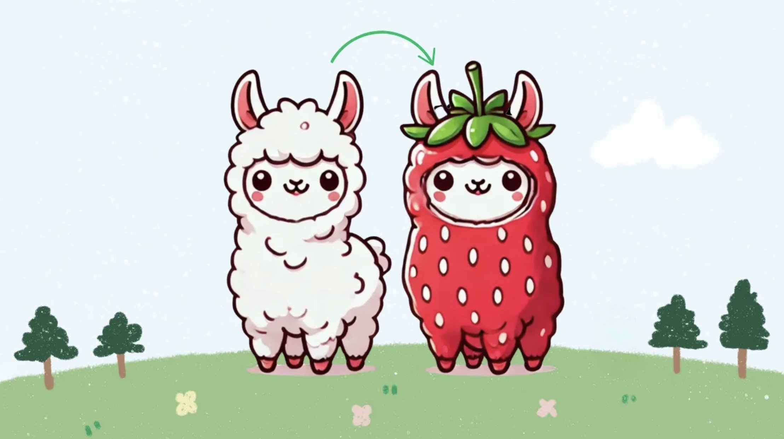

<div align="center">

# :strawberry: Ichigo: Local real-time voice AI (Formerly llama3-s).
<a href='https://homebrew.ltd/blog/llama3-just-got-ears'></a>
<a href='https://ichigo.homebrew.ltd/'></a>
<a href='https://arxiv.org/pdf/2410.15316'></a>
<a href='https://huggingface.co/homebrewltd'></a>
<a href='https://huggingface.co/homebrewltd'></a>
<a href='https://colab.research.google.com/drive/18IiwN0AzBZaox5o0iidXqWD1xKq11XbZ?usp=sharing'></a>

[**About**](#about) | [**Demo**](#demo) | [**Progress**](#progress) | [**Data Pipeline**](#synthetic-generation) | [**Training**](#training-with-torchtune)


  
  <p><small>Homebrewed early-fusion speech model</a></small></p>
</div>

> [!NOTE]  
> Update: September 30, 2024
> - We have rebranded from llama3-s to :strawberry: Ichigo.
> - Our custom-built early-fusion speech model now has a name and a voice.
> - It has improved multiturn capabilities and can now refuse to process inaudible queries.

> [!WARNING]  
> :strawberry: Ichigo is an open research experiment
> - Join us in the  `#research` channel in [Homebrew's Discord](https://discord.com/invite/FTk2MvZwJH)
> - We livestream training runs in `#research-livestream`

## About
:strawberry: Ichigo is an open, ongoing research experiment to extend a text-based LLM to have native "listening" ability. Think of it as an open data, open weight, on device Siri.

It uses an [early fusion](https://medium.com/@raj.pulapakura/multimodal-models-and-fusion-a-complete-guide-225ca91f6861#:~:text=3.3.,-Early%20Fusion&text=Early%20fusion%20refers%20to%20combining,fused%20representation%20through%20the%20model.) technique inspired by [Meta's Chameleon paper](https://arxiv.org/abs/2405.09818).

We ~~build~~ train in public:
- [Ichigo v0.3 Checkpoint Writeup](https://homebrew.ltd/blog/llama-learns-to-talk)
- [Ichigo v0.2 Checkpoint Writeup](https://homebrew.ltd/blog/llama3-just-got-ears)
- [Ichigo v0.1 Checkpoint Writeup](https://homebrew.ltd/blog/can-llama-3-listen)

## Demo
### WebUI
For instructions on how to self-host the Ichigo web UI demo using Docker, please visit: [Ichigo demo](https://github.com/homebrewltd/ichigo-demo/tree/docker). To try our demo on a single RTX 4090 GPU, you can go directly to: https://ichigo.homebrew.ltd
### Gradio Web UI
We offer code for users to create a web UI demo. Please follow the instructions below:
```
python -m venv demo
source demo/bin/activate
# First install all required packages
pip install --no-cache-dir -r ./demo/requirements.txt
```
Then run the command below to launch a Gradio demo locally. You can add the variables `use-4bit` and `use-8bit` for quantized usage:

```
python -m demo.app --host 0.0.0.0 --port 7860 --max-seq-len 1024 
```

You can also host a demo using vLLM for faster inference but its not support streaming output:

```
python -m demo.app_vllm
```
**Alternatively, you can easily try our demo on [HuggingFace](https://huggingface.co/spaces/jan-hq/Llama3.1-s-v0.2) 🤗**

## Progress
- 11 Nov: [Ichigo v0.4](https://huggingface.co/collections/homebrewltd/ichigo-v04-67317bde6dfdfdd55dddbc6e) models are now available. This update introduces a unified training pipeline by consolidating Phases 2 and 3, with training data enhancements that include migrating speech noise and multi-turn data to Phase 2 and adding synthetic noise-augmented multi-turn conversations. Achieving an improved MMLU score of 64.63, the model now boasts stronger context handling, advanced noise management, and enhanced multi-turn capabilities for a more robust and responsive user experience.
- 22 Oct: 📑 Research Paper Release: We are pleased to announce the publication of our research paper detailing the development and technical innovations behind Ichigo series. The full technical details, methodology, and experimental results are now available in our [paper](https://arxiv.org/pdf/2410.15316). 
- 4 Oct: [Ichigo v0.3](https://huggingface.co/collections/homebrewltd/ichigo-66ffc7484ef31ec5596ef6d0) models are now available. Utilizing cleaner and improved data, our model has achieved an enhanced MMLU score of 63.79 and demonstrates stronger speech instruction-following capabilities, even in multi-turn interactions. Additionally, by incorporating noise-synthetic data, we have successfully trained the model to refuse processing non-speech audio inputs from users, further improving its functionality and user experience.
- 23 Aug: We’re excited to share [Ichigo-llama3.1-s-instruct-v0.2](https://huggingface.co/homebrewltd/llama3.1-s-instruct-v0.2), our latest multimodal checkpoint with improved speech understanding by enhancing the model's audio instruction-following capabilities through training on interleaving synthetic data.  
- 17 Aug: We pre-trained our LLaMA 3.1 model on continuous speech data, tokenized using WhisperSpeechVQ. The final loss converged to approximately 1.9, resulting in our checkpoint: [Ichigo-llama3.1-s-base-v0.2](https://huggingface.co/homebrewltd/llama3.1-s-base-v0.2)
- 1 Aug: Identified typo in original training recipe, causing significant degradation (MMLU: 0.6 -> 0.2), proposed fixes.
- 30 July: Presented llama3-s progress at: [AI Training: From PyTorch to GPU Clusters](https://lu.ma/ws8t6wom?tk=wZvFmm)
- 19 July: [llama3-s-2024-07-19](https://huggingface.co/homebrewltd/llama3-s-2024-07-19) understands synthetic voice with limited results
- 1 July: [llama3-s-2024-07-08](https://huggingface.co/homebrewltd/llama3-s-2024-07-08) showed converging loss (1.7) with limited data

## Data Synthetic and Training Instruction


###  Synthetic Generation

For detailed information on synthetic generation, please refer to the [Synthetic Generation Guide](synthetic_data/README.md).

### Organize Directory 
1. First Clone the Repo from Github:
```
git clone --recurse-submodules https://github.com/homebrewltd/ichigo.git
```

2. The folder structure is as follows:
```
Ichigo
├── HF_Trainer                               # HF training code (deprecated)
├── synthetic_data                           # Synthetic data generation pipeline
    ├── configs                              # Audio pipeline configs
        ├── audio_to_audio                   # Parler audio (.wav) to semantic tokens
        ├── synthetic_generation_config      # TTS semantic tokens
├── scripts                                  # Setup scripts for Runpod
├── torchtune                                # Submodule: our fork of fsdp with checkpointing
├── model_zoo                                # Model checkpoints
│   ├── LLM
│   │   ├── Meta-Llama-3-8B-Instruct
│   │   ├── Meta-Llama-3-70B-Instruct
├── demo                                     # Selfhost this demo (vllm)
├── inference                                # Google Colab
```

### Training with HF Trainer (Deprecated) 
1. Install Dependencies
```
python -m venv hf_trainer
chmod +x scripts/install.sh
./scripts/install.sh
```
Restart shell now
```
chmod +x scripts/setup.sh
./scripts/setup.sh
source myenv/bin/activate
```
2. Logging Huggingface
```
huggingface-cli login --token=<token>
```
3. Training
```
export CUTLASS_PATH="cutlass"
export CUDA_VISIBLE_DEVICES=0,1,2,3,4,5,6,7
accelerate launch --config_file ./accelerate_config.yaml train.py 
```

### Training with Torchtune

1. **Install Package**
      ```bash
      python -m venv torchtune
      pip install torch torchvision torchao tensorboard
      mkdir model_zoo
      cd ./torchtune
      pip install -e .
      ```
      Logging Huggingface: 
      ```bash
      huggingface-cli login --token=<token>
      ```
      Download the [`tokenizer.model`](https://huggingface.co/meta-llama/Llama-3.1-8B-Instruct/blob/main/original/tokenizer.model) and the required model using the `tune` in the `ichigo/model_zoo` directory:
      ```bash
      tune download homebrewltd/llama3.1-s-whispervq-init --output-dir ../model_zoo/llama3.1-s-whispervq-init --ignore-patterns "original/consolidated*"
      ```

2. **Pretraining Multi GPU (1-8GPUs Supported)**
      ```
      tune run --nproc_per_node <no-gpu> full_finetune_fsdp2 --config recipes/configs/jan-llama3-1-s/pretrain/8B_full.yaml
      ```
      [NOTE] : After training finished, please use this script to convert checkpoint to format that can be loaded by HF transformers:
      ```python
      from transformers import AutoModelForCausalLM, AutoTokenizer
      from huggingface_hub import HfApi, HfFolder
      import torch
      import os
      import glob
      from tqdm import tqdm

      # folder containing the checkpoint files
      output_dir = "../model_zoo/llama3-1-s-base"
      pt_to_merge = glob.glob(f"{output_dir}/hf_model_000*_1.pt")
      state_dicts = [torch.load(p) for p in tqdm(pt_to_merge)]
      merged_state_dicts = {k: v for d in state_dicts for k, v in d.items()}
      torch.save(merged_state_dicts, f"{output_dir}/pytorch_model.bin")
      model = AutoModelForCausalLM.from_pretrained(output_dir, torch_dtype=torch.bfloat16)
      print(model)
      tokenizer_path = "homebrewltd/llama3.1-s-whispervq-init"
      tokenizer = AutoTokenizer.from_pretrained(tokenizer_path)
      # # Save the updated model and tokenizer locally
      tokenizer.save_pretrained(output_dir)
      model.push_to_hub("<your_hf>/Llama3.1-s-base")
      tokenizer.push_to_hub("<your_hf>/Llama3.1-s-base")
      ```
3. **Instruction Tuning**
      
      Download checkpoint from huggingface using the `tune` or use your local pretrained checkpoint located at `model_zoo/llama3-1-s-base`:
      ```
      tune run --nproc_per_node <no-gpu> full_finetune_fsdp2 --config recipes/configs/jan-llama3-1-s/finetune/8B_full.yaml
      ```
## References
```bibtex
@misc{chameleonteam2024chameleonmixedmodalearlyfusionfoundation,
      title={Chameleon: Mixed-Modal Early-Fusion Foundation Models}, 
      author={Chameleon Team},
      year={2024},
      eprint={2405.09818},
      archivePrefix={arXiv},
      primaryClass={cs.CL},
      journal={arXiv preprint}
}

@misc{zhang2024adamminiusefewerlearning,
      title={Adam-mini: Use Fewer Learning Rates To Gain More}, 
      author={Yushun Zhang and Congliang Chen and Ziniu Li and Tian Ding and Chenwei Wu and Yinyu Ye and Zhi-Quan Luo and Ruoyu Sun},
      year={2024},
      eprint={2406.16793},
      archivePrefix={arXiv},
      primaryClass={cs.LG},
      journal={arXiv preprint}
}

@misc{defossez2022highfi,
      title={High Fidelity Neural Audio Compression},
      author={Défossez, Alexandre and Copet, Jade and Synnaeve, Gabriel and Adi, Yossi},
      year={2022},
      eprint={2210.13438},
      archivePrefix={arXiv},
      journal={arXiv preprint}
}

@misc{WhisperSpeech,
      title={WhisperSpeech: An Open Source Text-to-Speech System Built by Inverting Whisper}, 
      author={Collabora and LAION},
      year={2024},
      url={https://github.com/collabora/WhisperSpeech},
      note={GitHub repository}
}
```
## Join Us

:strawberry: Ichigo is an open research project. We're looking for collaborators, and will likely move towards crowdsourcing speech datasets in the future. 
## Acknowledgement

- [Torchtune](https://github.com/pytorch/torchtune): The codebase we built upon
- [Accelerate](https://github.com/huggingface/accelerate): Library for easy use of distributed training
- [WhisperSpeech](https://github.com/collabora/WhisperSpeech): Text-to-speech model for synthetic audio generation 
- [Encodec](https://github.com/facebookresearch/encodec): High-fidelity neural audio codec for efficient audio compression
- [Llama3](https://huggingface.co/collections/meta-llama/meta-llama-3-66214712577ca38149ebb2b6): the Family of Models that we based on that has the amazing language capabilities !!!
