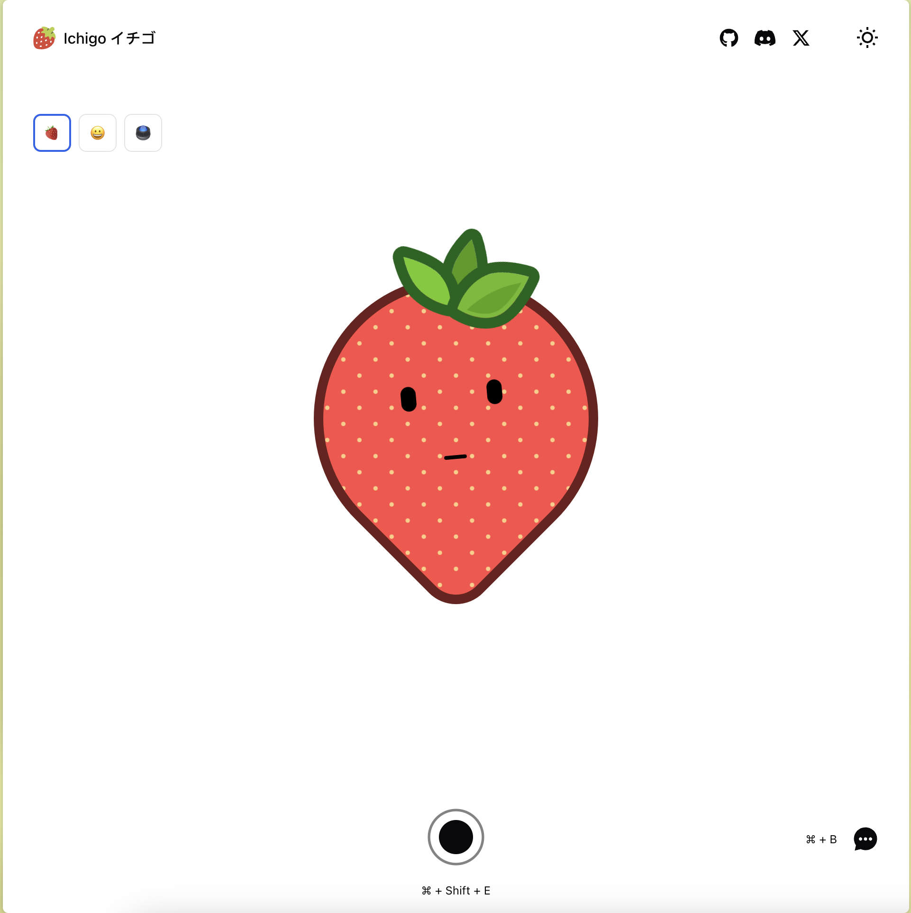

<div align="center">

# :strawberry: Ichigo: The local real-time voice AI (Formerly llama3-s).
<a href='https://homebrew.ltd/blog/llama3-just-got-ears'></a>
<a href='https://demo.homebrew.ltd/'></a>
<a href='https://huggingface.co/homebrewltd'></a>
<a href='https://huggingface.co/homebrewltd'></a>

  
  <p><small>"Homebrewed early-fusion speech model"</a></small></p>
</div>

> [!NOTE]  
> 23nd Aug 2024 Update:
> - Demo: [https://demo.homebrew.ltd/](https://demo.homebrew.ltd/)
> - Processes single-sound instruction data, under 10s, English

> [!WARNING]  
> :strawberry: Ichigo is an open research experiment
> - Join us in the  `#research` channel in [Homebrew's Discord](https://discord.com/invite/FTk2MvZwJH)
> - We livestream training runs in `#research-livestream`

## About
:strawberry: Ichigo is an open, ongoing research experiment to extend a text-based LLM to have native "listening" ability. Think of it as an open data, open weight, on device Siri.

It uses an [early fusion](https://medium.com/@raj.pulapakura/multimodal-models-and-fusion-a-complete-guide-225ca91f6861#:~:text=3.3.,-Early%20Fusion&text=Early%20fusion%20refers%20to%20combining,fused%20representation%20through%20the%20model.) technique inspired by [Meta's Chameleon paper](https://arxiv.org/abs/2405.09818).

We ~~build~~ train in public:
- [Ichigo v0.2 Checkpoint Writeup](https://homebrew.ltd/blog/llama3-just-got-ears)
- [Ichigo v0.1 Checkpoint Writeup](https://homebrew.ltd/blog/can-llama-3-listen)

## Progress
- 23 Aug: We’re excited to share [llama3.1-s-instruct-v0.2](https://huggingface.co/homebrewltd/llama3.1-s-instruct-v0.2), our latest multimodal checkpoint with improved speech understanding by enhancing the model's audio instruction-following capabilities through training on interleaving synthetic data.  
- 17 Aug: We pre-trained our LLaMA 3.1 model on continuous speech data, tokenized using WhisperSpeechVQ. The final loss converged to approximately 1.9, resulting in our checkpoint: [llama3.1-s-base-v0.2](https://huggingface.co/homebrewltd/llama3.1-s-base-v0.2)
- 2 Aug: Retrained phase 1 with llama3.1 and fixes to hyperparameters, achieving significant improvement (MMLU: 0.66 -> 0.61)
- 1 Aug: Identified typo in original training recipe, causing significant degradation (MMLU: 0.6 -> 0.2), proposed fixes.
- 30 July: Presented llama3-s progress at: [AI Training: From PyTorch to GPU Clusters](https://lu.ma/ws8t6wom?tk=wZvFmm)
- 19 July: [llama3-s-2024-07-19](https://huggingface.co/homebrewltd/llama3-s-2024-07-19) understands synthetic voice with limited results
- 1 July: [llama3-s-2024-07-08](https://huggingface.co/homebrewltd/llama3-s-2024-07-08) showed converging loss (1.7) with limited data

## Join Us

:strawberry: Ichigo is an open research project. We're looking for collaborators, and will likely move towards crowdsourcing speech datasets in the future. 

### Quickstart with Google Colab

Checkout this notebook to try our latest model:

[](https://colab.research.google.com/drive/18IiwN0AzBZaox5o0iidXqWD1xKq11XbZ?usp=sharing)


###  Synthetic Generation

For detailed information on synthetic generation, please refer to the [Synthetic Generation Guide](synthetic_data/README.md).

### Organize the input/output directory 
1. First Clone the Repo from github:
```
git clone --recurse-submodules https://github.com/homebrewltd/llama3-s.git
```

2. The folder structure is as follows:
```
Ichigo
├── HF_Trainer                               # HF training code (deprecated)
├── synthetic_data                           # Synthetic data generation pipeline
    ├── configs                              # Audio pipeline configs
        ├── audio_to_audio                   # Parler audio (.wav) to semantic tokens
        ├── synthetic_generation_config      # TTS semantic tokens
├── scripts                                  # Setup scripts for Runpod
├── torchtune                                # Submodule: our fork of fsdp with checkpointing
├── model_zoo                                # Model checkpoints
│   ├── LLM
│   │   ├── Meta-Llama-3-8B-Instruct
│   │   ├── Meta-Llama-3-70B-Instruct
├── demo                                     # Selfhost this demo (vllm)
├── inference                                # Google Colab
```

### Training with HF Trainer
1. Install Dependencies
```
python -m venv hf_trainer
chmod +x scripts/install.sh
./scripts/install.sh
```
Restart shell now
```
chmod +x scripts/setup.sh
./scripts/setup.sh
source myenv/bin/activate
```
2. Logging Huggingface
```
huggingface-cli login --token=<token>
```
3. Training
```
export CUTLASS_PATH="cutlass"
export CUDA_VISIBLE_DEVICES=0,1,2,3,4,5,6,7
accelerate launch --config_file ./accelerate_config.yaml train.py 
```

### Training with Torchtune
1. Install Package
```
python -m venv torchtune
pip install torch torchvision tensorboard
cd ./torchtune
pip install -e .
```
You can also download the model using tune:
```
tune download homebrewltd/llama3.1-s-whispervq-init --hf-token <token>  --output-dir ../model_zoo/llama3.1-s-whispervq-init --ignore-patterns "original/consolidated*"
```
Setup the Dataset from HF path by change the path and change the name of the model in the following YAML file.
```
nano torchtune/recipes/configs/jan-llama3-s/8B_full.yaml
```

2. Training Multi GPU (1-8GPUs Supported)
```
tune run --nproc_per_node 4 full_finetune_fsdp2 --config recipes/configs/jan-llama3-1-s/8B_full.yaml
```
## Demo

### Gradio Web UI
We offer code for users to create a web UI demo. Please follow the instructions below:
```
python -m venv demo
source demo/bin/activate
# First install all required packages
pip install --no-cache-dir -r ./demo/requirements.txt
```
Then run the command below to launch a Gradio demo locally. You can add the variables `use-4bit` and `use-8bit` for quantized usage:

```
python -m demo.app --host 0.0.0.0 --port 7860 --max-seq-len 1024 
```

You can also host a demo using vLLM for faster inference but its not support streaming output:

```
python -m demo.app_vllm
```
**Alternatively, you can easily try our demo on [HuggingFace](https://huggingface.co/spaces/jan-hq/Llama3.1-s-v0.2) 🤗**
## References
```bibtex
@misc{chameleonteam2024chameleonmixedmodalearlyfusionfoundation,
      title={Chameleon: Mixed-Modal Early-Fusion Foundation Models}, 
      author={Chameleon Team},
      year={2024},
      eprint={2405.09818},
      archivePrefix={arXiv},
      primaryClass={cs.CL},
      journal={arXiv preprint}
}

@misc{zhang2024adamminiusefewerlearning,
      title={Adam-mini: Use Fewer Learning Rates To Gain More}, 
      author={Yushun Zhang and Congliang Chen and Ziniu Li and Tian Ding and Chenwei Wu and Yinyu Ye and Zhi-Quan Luo and Ruoyu Sun},
      year={2024},
      eprint={2406.16793},
      archivePrefix={arXiv},
      primaryClass={cs.LG},
      journal={arXiv preprint}
}

@misc{defossez2022highfi,
      title={High Fidelity Neural Audio Compression},
      author={Défossez, Alexandre and Copet, Jade and Synnaeve, Gabriel and Adi, Yossi},
      year={2022},
      eprint={2210.13438},
      archivePrefix={arXiv},
      journal={arXiv preprint}
}

@misc{WhisperSpeech,
      title={WhisperSpeech: An Open Source Text-to-Speech System Built by Inverting Whisper}, 
      author={Collabora and LAION},
      year={2024},
      url={https://github.com/collabora/WhisperSpeech},
      note={GitHub repository}
}
```
## Acknowledgement

- [Torchtune](https://github.com/pytorch/torchtune): The codebase we built upon
- [Accelerate](https://github.com/huggingface/accelerate): Library for easy use of distributed training
- [WhisperSpeech](https://github.com/collabora/WhisperSpeech): Text-to-speech model for synthetic audio generation 
- [Encodec](https://github.com/facebookresearch/encodec): High-fidelity neural audio codec for efficient audio compression
- [Llama3](https://huggingface.co/collections/meta-llama/meta-llama-3-66214712577ca38149ebb2b6): the Family of Models that we based on that has the amazing language capabilities !!!
