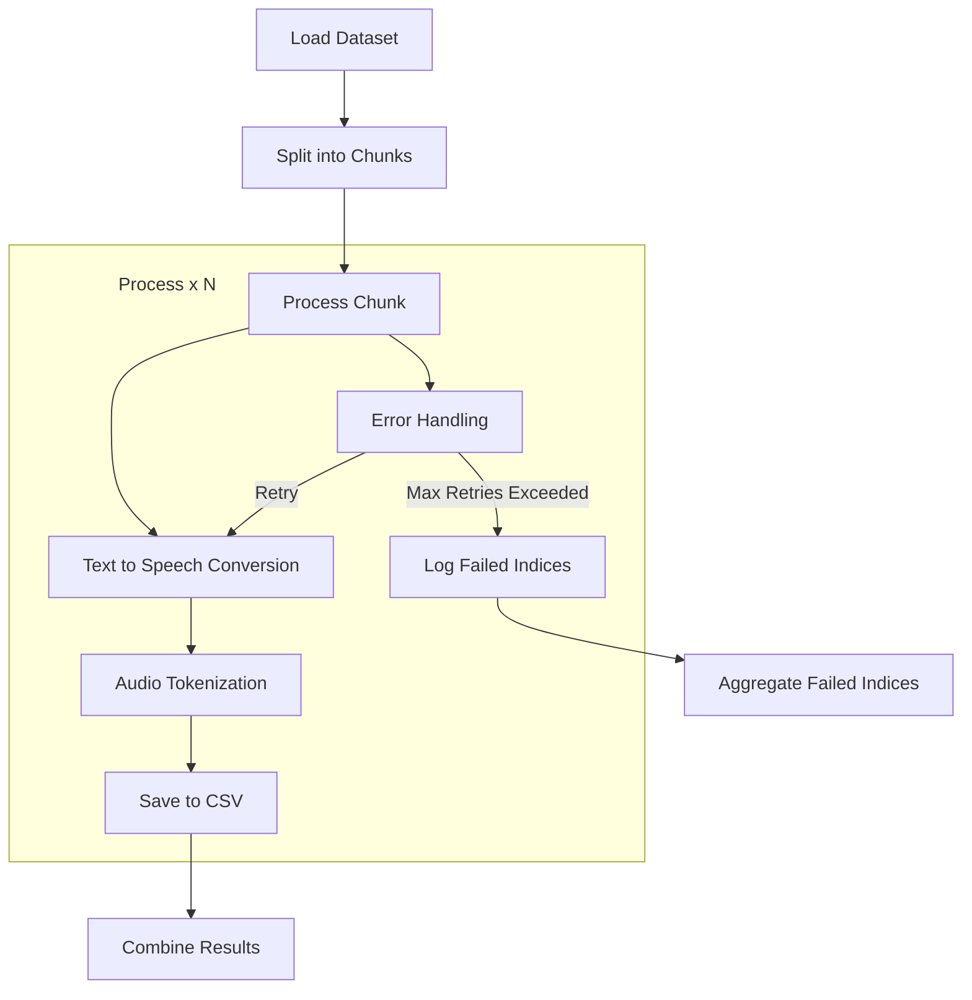

# Synthetic Data Pipeline - Sound Instruct

## 1. Introduction

The Synthetic Data Pipeline is designed to process large raw-text dataset into trainable sound. This pipeline leverages:
- First, WhisperSpeech to convert text into speech.
- Second, Encodec to convert into trainable sound tokens.

However, as WhisperSpeech and Encodec do not support batch processing, this pipeline is designed to process data in parallel across multiple GPUs in multiple processes.

## 2. Features

- Multi-GPU and multi-process for each GPU
- Text-to-speech conversion using WhisperSpeech
- Audio tokenization using EncodecModel
- CSV output for easy integration and recovery
- Configurable batch processing
- Progress tracking and logging

## 3. Requirements

### 3.1 Hardware

- Multiple CUDA-capable GPUs (tested with 4 GPUs)
- Sufficient RAM to handle large datasets
- Fast storage for input/output operations

### 3.2 Software

- torch
- pyarrow
- datasets
- WhisperSpeech
- encodec
- Other dependencies listed in `requirements.txt`

## 4. Installation

1. Move to the directory:
   ```
   cd synthetic-data
   ```

2. Install the required packages:
   ```
   pip install -r requirements.txt
   ```

## 5. Project Structure

```
synthetic-data-pipeline/
├── synthetic_data_pipeline.py
├── audio_tokenizer.py
├── tts_processor.py
├── requirements.txt
├── README.md
└── <save_dir>/
    ├── audio_tokens_*.csv
    └── failed_indices_*.json
```

## 6. Configuration

Edit the `synthetic_generation_cfg.yaml` file to configure the following parameters:

```yaml
# Dataset configuration
dataset:
  name:                                   # Dataset name from Hugging Face
  split:                                  # Dataset split to use
  remaining_indices_file:                 # File to store remaining indices (List[int])

# Processing configuration
processing:
  do_test:                                # Whether to run the test
  devices:                                # List of GPUs to use
  num_procs_per_device:                   # Number of processes per GPU
  save_dir:                               # Directory to save processed data
  save_batch_size:                        # Batch size for saving processed data for each process
  max_retries:                            # Maximum number of retries for processing a sample
  sample_rate:                            # Sample rate for audio data    


# Logging configuration
logging:
  log_file:                               # Log file name
  console_level:                          # Console log level
  file_level:                             # File log level  
```

## 7. Usage

### 7.1 Running the Pipeline

To run the full pipeline:

```python
python synthetic_data_pipeline.py
```

### 7.2 Test Mode

To run the pipeline in test mode with a smaller dataset. modify the `do_test` parameter in the configuration file:

```
...
processing:
    do_test: true
...
```

## 8. Pipeline Components

### 8.1 Text-to-Speech Processor

The `TTSProcessor` class uses WhisperSpeech to convert text prompts into audio waveforms. It's initialized with a specific device (GPU) and can generate audio from text inputs.

### 8.2 Audio Tokenizer

The `AudioTokenizer` class uses EncodecModel to process audio waveforms into tokenized representations. It can also decode audio tokens back into waveforms if needed.

## 9. Data Flow



## 10. Acknowledgements

This pipeline is built on top of the [WhisperSpeech](https://github.com/collabora/WhisperSpeech) and [Encodec](https://github.com/facebookresearch/encodec) libraries. We would like to thank the developers of these libraries for their contributions to the field of audio processing.